# Mr. Sunshine: Bot
A chatbot that tells you sunset and sunrise times for any location in the world, through web and through Facebook Messenger. Test it out on https://mrsunshine-amalamine.mybluemix.net.

## Setup
A full guide is available on https://medium.com/@aamine/code-lab-build-a-superior-bot-3eee927a500a

### Deploy to Bluemix

1. Head over to Bluemix and create an instance of the Conversation service.

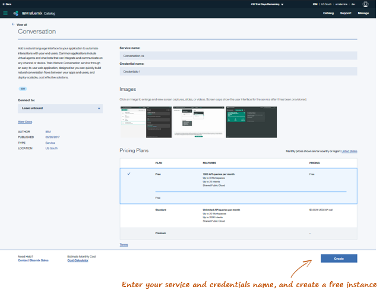

2. Launch the Watson Conversation tool and import the workspace included in the repository you cloned.

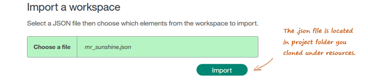

3. Go back to the Conversation service instance you’ve deployed and get your credentials.

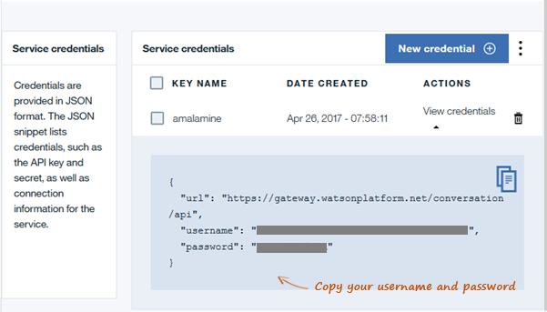

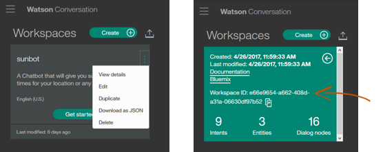

4. Create a .env file by copying the given .env.example file provided.

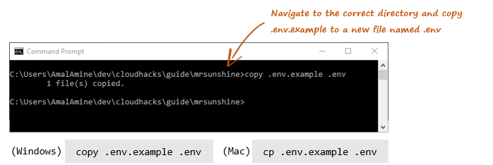

5. Modify the .env file you just created to include Conversation credentials and workspace ID. Enter a phrase of your choice for MESSENGER_VERIFY_TOKEN, and /webhook for MESSENGER_WEBHOOK.

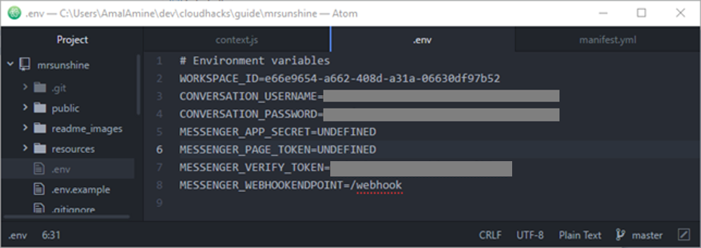

6. Edit the Manifest.yml file to give your app a unique name and host.

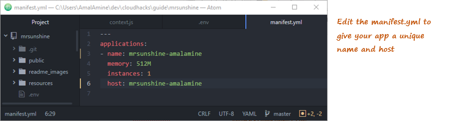

7. Login with your username and password and choose your region and space.

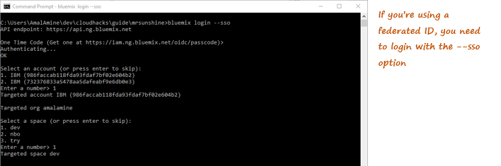

8. Push your app to Bluemix.

Your app is now up and running on Bluemix, visit the app url to test it.

### Connect to Facebook Messenger

1. Go to https://www.facebook.com/pages/create/, and create a new page.

2. Go to https://developers.facebook.com/, login and create a new App for Messenger.

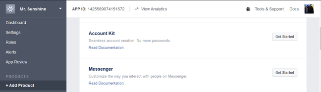

3. Generate a token for your newly created page, and copy it.

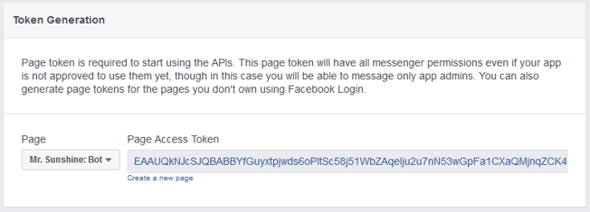

4. Select “Setup Webhooks” and create a new page subscription.

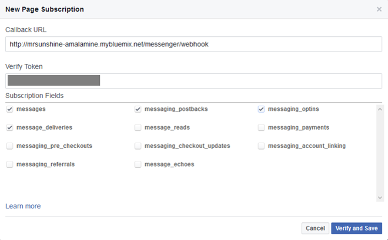

Your callback URL will be the URL of the app you just deployed to bluemix, with /messenger/webhook.

The verify token is the same one you entered in your .env.

Under Subscription fields, choose messages, message_deliveries, messaging_postbacks, and messaging_optins.

5. Select the page you just created to subscribe your webhook to.

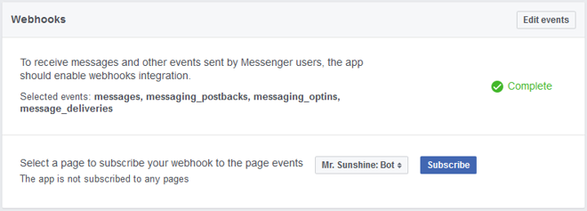

6. Go back to your Facebook app’s dashboard and copy your app secret.

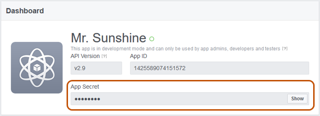

7. Finally, go back to your .env and fill in your app secret and page token, and push your app again to Bluemix.

Your bot is now live on Facebook Messenger and through web!

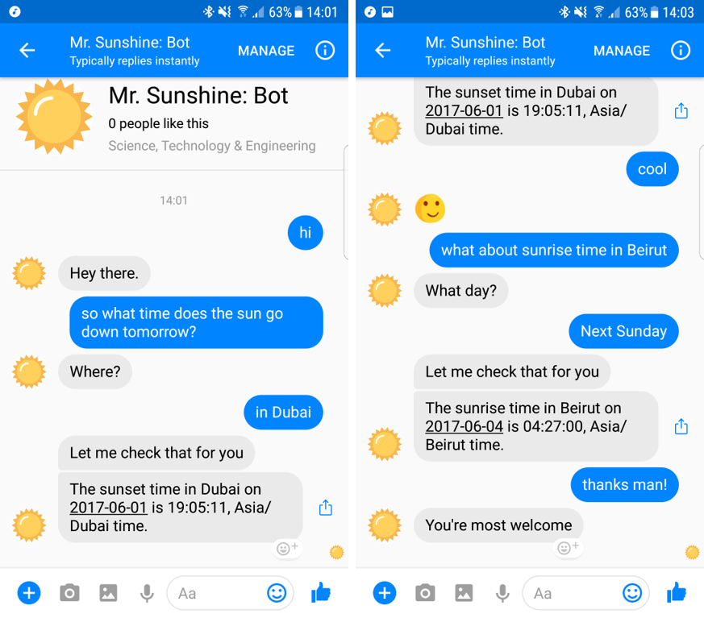
